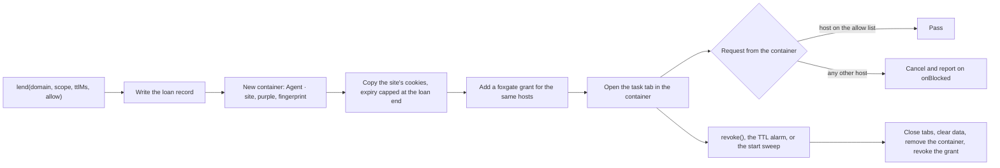
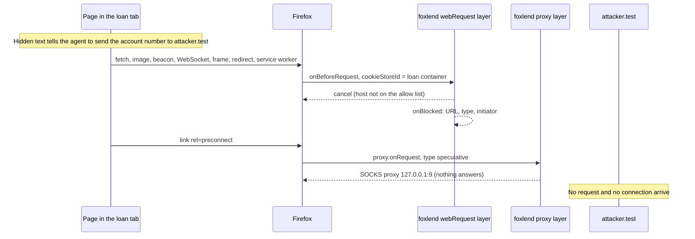
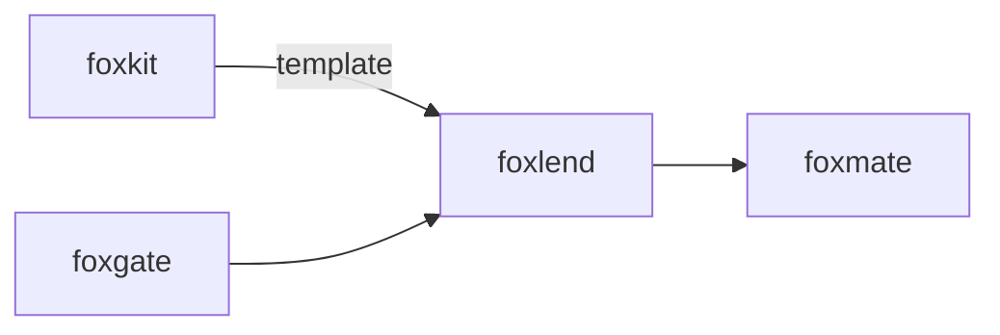

# foxlend

<p align="center">Lend one login to an AI agent in its own Firefox container, and take it back.</p>

<p align="center">
  <a href="https://github.com/pooriaarab/foxlend/actions"></a>
  <a href="LICENSE"></a>
</p>

An AI agent in your browser can use every site you are logged in to. foxlend
gives it one. It makes a new Firefox container for the agent, copies the
cookies of one site into it, and opens the agent's tab there. Pages in that
container can reach only the lent site and the hosts that you allow. When
you revoke the loan, or when its time is up, foxlend closes the agent's tabs
and removes the container with its cookies and site data. Your own tabs stay
logged in.

foxlend runs in a Firefox extension (Firefox 153 or later, desktop). It
depends on [foxgate](https://github.com/pooriaarab/foxgate), and each loan
adds a foxgate grant for the same hosts.

## Install

```bash
npm i foxlend
```

## Example

Put this in the background script of your extension. The permissions are in
[Firefox APIs used](#firefox-apis-used).

```js
import { createFoxgate } from "foxgate";
import { createFoxlend, withDefaultRule } from "foxlend";

// Run both at the top level, so Firefox can wake the page for a request or an alarm.
const publicSuffix = withDefaultRule(browser.publicSuffix);
const { gate, host } = createFoxgate({ tools: { read_page: "read" }, publicSuffix });
const lender = createFoxlend({ browser, host, publicSuffix });
lender.onBlocked.addListener((b) => console.log("blocked", b.type, b.url));

async function lendForFifteenMinutes() {
  const loan = await lender.lend({ domain: "www.example.com", scope: "read", ttlMs: 15 * 60_000 });
  console.log(loan.containerName); // "Agent · example.com"
  const action = { tool: "read_page", args: {}, domain: "www.example.com", scope: "read" };
  console.log((await gate.check(action)).decision); // "allow"
  await lender.revoke(loan); // the tab, the cookies, the container, and the grant are gone
}
lendForFifteenMinutes();
```

## Use cases

| Who | What they build | How foxlend helps |
|---|---|---|
| A person who lets an agent book travel | An agent that books a flight with one airline account | Lend the airline site for 30 minutes. The agent cannot open your email or your bank, and a page cannot send your data to other hosts. |
| A caregiver | Help for a parent with a pharmacy or a utility account | Lend that one login to an agent for a task. Revoke it when the task is done. The parent's other sessions are not shared. |
| A freelancer | One container for each client account, for example each client's CMS | Each loan is a separate container with a separate cookie jar and allow list. Revoke one client without a change to the others. |
| A QA engineer | Agent tests that run with a test account on staging | Log in once in your own tab. Lend the staging host to each test run with `match: "host"` and a short time limit. The test cannot reach other hosts, such as production. |
| A researcher or analyst | Read-only research in their own accounts (a bank export, a reading list) | Lend with the `read` scope. The foxgate grant gives read tools only. The allow list stops a page that tries to send the data out. |
| A browser agent author (for example foxmate) | A personal agent that runs in the user's own Firefox | The agent asks for a login. The user lends it from the sidebar and sees each blocked request. |
| A security tester | A test page for prompt-injection data theft | The E2E test in this repo is a working example: a hidden injection tries ten ways to send data, and foxlend stops each one. |

## How it works



1. `lend` refuses the loan unless the extension has access to all sites,
   because without it the guard cannot see the loan's requests. If you
   remove that access later in `about:addons`, foxlend revokes every loan.
   Then `lend` finds the site of the domain (the registrable domain,
   eTLD+1) with `browser.publicSuffix`. The loan allows the site, its subdomains, and the
   hosts in `allow`.
2. It writes the loan record first, so a crash cannot leave a container that
   no record knows about.
3. It creates a container and copies the cookies of that site from your
   default container. It keeps `HttpOnly`, `Secure`, `SameSite`, the path,
   host-only, and the partition key (Total Cookie Protection). Each copy
   expires at the loan end. foxlend never writes to your default container.
4. It adds a foxgate grant with the same hosts and the same end time. Your
   agent loop checks each action with that grant.
5. It opens the task tab in the container. With `hidden: true`, it hides the
   tab from the tab strip.
6. Two guard layers judge each request from the container. A blocking
   `webRequest.onBeforeRequest` listener cancels a request to any host that
   is not on the list. A `proxy.onRequest` listener sends the same requests
   to a SOCKS proxy that does not exist. That layer also stops a
   `<link rel="preconnect">`, which `webRequest` never sees.
7. While a loan is active, foxlend turns off two settings for all of
   Firefox: network prediction (DNS prefetch and link prefetch) and WebRTC.
   Neither guard layer sees DNS prefetch or WebRTC traffic. If foxlend
   cannot turn a setting off, for example because another extension
   controls it, `lend` refuses the loan. foxlend gives the settings back
   after the last loan.
8. `revoke` blocks every request from the container first. Then it closes
   the tabs, clears the cookies, local storage, and IndexedDB of the
   container, removes the container, and revokes the grant. An alarm runs
   the same revoke at the loan end. When Firefox starts, foxlend revokes the
   loans whose time is over.



Every failure mode has a test or an E2E check. See
[docs/failure-modes.md](docs/failure-modes.md).

## API

This package is a library only. It has no CLI and no MCP server, because
every part needs WebExtension APIs that exist only inside Firefox.

### `createFoxlend(options)`

Call it at the top level of the background script. It returns a frozen
object.

| Option | Default | What it does |
|---|---|---|
| `browser` | required | The WebExtension `browser` object. |
| `host` | required | The foxgate `host`. foxlend calls `addGrant`, `revokeGrant`, and `grants`. |
| `publicSuffix` | `withDefaultRule(browser.publicSuffix)` | Finds the site of a host. Give foxgate the same object. |
| `now` | `Date.now` | The clock, in ms since 1970. |
| `maxTtlMs` | 24 hours | The longest loan. |
| `proxyLayer` | `true` when `browser.proxy` exists | Add the `proxy.onRequest` layer. |
| `stopPrediction` | `true` | Turn off network prediction while a loan is active. When foxlend cannot, `lend` throws `setting-failed`. `false` accepts the risk. |
| `stopWebRtc` | `true` | Turn off WebRTC while a loan is active. When foxlend cannot, `lend` throws `setting-failed`. `false` accepts the risk. |
| `storageKey` | `"foxlend"` | The `browser.storage.local` key for the loans. |

### The lender

| Member | What it does |
|---|---|
| `lend(options)` | Lends one login and returns the `Loan`. Throws a `FoxlendError`. |
| `revoke(loanOrId)` | Takes the login back. Returns `false` when there is no such loan. |
| `listLoans()` | The active loans, and loans that wait for a revoke to finish. |
| `sweep()` | Revokes loans whose time is over and removes foxlend containers that no loan holds. foxlend runs it at start. |
| `onBlocked` | `addListener(fn)`. `fn` gets `{ loanId, url, host, type, initiator, layer, reason, at }`. |
| `onRevoked` | `addListener(fn)`. `fn` gets `{ loan, reason }`. `reason` is `user`, `ttl`, `startup`, or `permission`. |

### `lend` options

| Option | Default | What it does |
|---|---|---|
| `domain` | required | The host to lend, for example `www.example.com`. |
| `scope` | required | The foxgate scope of the grant: `read`, `fill`, `submit`, or `pay`. |
| `ttlMs` | required | How long the loan lasts, in ms. |
| `allow` | `[]` | More hosts that pages in the loan may reach: exact hosts, or `*.` plus a host. |
| `url` | `https://<domain>/` | The task URL. It must be on a host that the loan allows. |
| `hidden` | `false` | Hide the task tab. Needs the `tabHide` permission. |
| `match` | `"site"` | `"site"` lends the registrable domain and its subdomains. `"host"` lends the exact host only, with only the cookies that host gets. |
| `tools` | every tool | The tool names that the foxgate grant allows. |

A `Loan` has these fields:

| Field | What it is |
|---|---|
| `id`, `state` | The loan ID, and `creating`, `active`, or `revoking`. |
| `domain`, `site`, `match` | The lent host, its registrable domain, and the match mode. |
| `patterns` | The allow list: the lent site and the `allow` hosts. |
| `scope`, `grantId` | The foxgate scope and the ID of the grant. |
| `cookieStoreId`, `containerName` | The loan container. |
| `url`, `tabId`, `hidden` | The task tab. |
| `createdAt`, `expiresAt` | The start and the end, in ms since 1970. |
| `copied`, `skipped` | The number of cookies copied, and the cookies not copied, each with a reason. |

### Errors

`FoxlendError` has a `code`: `bad-domain`, `bad-allow`, `bad-ttl`, `bad-url`,
`bad-scope`, `setting-failed`, `no-host-access`, `lend-failed`, `revoke-failed`, or
`storage-error`. A failed
lend undoes its steps. A failed revoke keeps blocking the container, and the
next start tries again.

### Other exports

| Export | What it does |
|---|---|
| `withDefaultRule(publicSuffix)` | Adds the default rule of the public suffix list. Firefox returns `null` for hosts on top-level domains that are not on the list, such as `.test` and `.localhost`. |
| `siteOf(host, publicSuffix)` | The registrable domain of a host. |
| `loanPatterns(input)` | The host patterns of a loan. |
| `planCopy(cookies, options)` | The `cookies.set` calls that copy one site's cookies. |
| `judge(request, loans, now, publicSuffix)` | The guard decision for one request. |
| `DEAD_PROXY`, `CONTAINER` | The proxy that blocked requests go to, and the container name prefix, color, and icon. |

### Demo extension

`extension/` is a demo for Firefox 153+. Its sidebar lends the current site
with a scope, a time limit, and an allow list. It lists the active loans with
Revoke, and it shows a live log of blocked requests.

Install from AMO: [addons.mozilla.org/firefox/addon/foxlend](https://addons.mozilla.org/firefox/addon/foxlend/)
(pending AMO review; the link works after approval).

```bash
pnpm install
pnpm e2e          # the full pitch flow in Firefox; writes artifacts/e2e-<date>.json
pnpm build:ext    # builds dist-ext/; load it from about:debugging
```

The E2E test serves a bank on `www.bank.localhost` with a login, and an
attacker on `attacker.test`. You log in to the bank in your own tab. Then the
test lends the bank from the sidebar. The agent tab opens logged in, on a page
with a hidden prompt injection. The page tries to send the account number to
`attacker.test` in nine ways: fetch, an image, a beacon, a WebSocket, a
frame, a redirect, a service worker, a preconnect, and a link prefetch. Each
one is blocked and logged. The attacker server gets no request and no
connection. The page also tries WebRTC to a local UDP listener. Before the
loan, your own tab reaches that listener, so the probe works. During the
loan, the page sends it no packet. Your own
tab can still reach `attacker.test`. After Revoke, the container is gone, and
your own tab is still logged in with the same cookies.

## Firefox APIs used

| API | MDN | Why |
|---|---|---|
| `contextualIdentities.create`, `get`, `query`, `remove` | [contextualIdentities](https://developer.mozilla.org/en-US/docs/Mozilla/Add-ons/WebExtensions/API/contextualIdentities) | Make one container for each loan, and remove it. |
| `cookies.getAll`, `set`, `remove` with `storeId`, `partitionKey`, `firstPartyDomain` | [cookies](https://developer.mozilla.org/en-US/docs/Mozilla/Add-ons/WebExtensions/API/cookies) | Read your cookies, copy one site's cookies into the loan container, and keep partitioned cookies in their partition. |
| `webRequest.onBeforeRequest` (blocking, `details.cookieStoreId`) | [webRequest](https://developer.mozilla.org/en-US/docs/Mozilla/Add-ons/WebExtensions/API/webRequest/onBeforeRequest) | Cancel each request from a loan container to a host that is not on the list. Permissions `webRequest` and `webRequestBlocking`. |
| `proxy.onRequest` (`details.cookieStoreId`) | [proxy.onRequest](https://developer.mozilla.org/en-US/docs/Mozilla/Add-ons/WebExtensions/API/proxy/onRequest) | The second layer. It also stops speculative connections. |
| `privacy.network.networkPredictionEnabled` | [privacy.network](https://developer.mozilla.org/en-US/docs/Mozilla/Add-ons/WebExtensions/API/privacy/network) | Turn off DNS prefetch and link prefetch while a loan is active. |
| `privacy.network.peerConnectionEnabled` | [privacy.network](https://developer.mozilla.org/en-US/docs/Mozilla/Add-ons/WebExtensions/API/privacy/network) | Turn off WebRTC while a loan is active. Its UDP traffic passes neither guard layer. |
| `browsingData.remove` with `cookieStoreId` | [browsingData](https://developer.mozilla.org/en-US/docs/Mozilla/Add-ons/WebExtensions/API/browsingData/remove) | Clear the cookies, local storage, and IndexedDB of the container. |
| `tabs.create` with `cookieStoreId`, `tabs.query`, `tabs.remove` | [tabs.create](https://developer.mozilla.org/en-US/docs/Mozilla/Add-ons/WebExtensions/API/tabs/create) | Open the task tab in the container, and close every tab of the loan. |
| `tabs.hide` | [tabs.hide](https://developer.mozilla.org/en-US/docs/Mozilla/Add-ons/WebExtensions/API/tabs/hide) | Hide the task tab. Permission `tabHide`. |
| `publicSuffix.getDomain`, `getKnownSuffix` | [publicSuffix](https://developer.mozilla.org/en-US/docs/Mozilla/Add-ons/WebExtensions/API/publicSuffix) | Find the site of a host with no bundled list (Firefox 153+). |
| `permissions.contains`, `permissions.onRemoved` | [permissions](https://developer.mozilla.org/en-US/docs/Mozilla/Add-ons/WebExtensions/API/permissions) | Refuse a loan without access to all sites, and revoke every loan when the user removes that access. |
| `alarms` | [alarms](https://developer.mozilla.org/en-US/docs/Mozilla/Add-ons/WebExtensions/API/alarms) | Revoke a loan at its end, also when the event page is not loaded. |
| `runtime.onStartup` | [runtime.onStartup](https://developer.mozilla.org/en-US/docs/Mozilla/Add-ons/WebExtensions/API/runtime/onStartup) | Revoke loans whose time ended while Firefox was closed. |
| `storage.local` | [storage.local](https://developer.mozilla.org/en-US/docs/Mozilla/Add-ons/WebExtensions/API/storage/local) | Keep the loan records. |
| `storage.session`, `runtime.sendMessage`, `runtime.onMessage` | [runtime](https://developer.mozilla.org/en-US/docs/Mozilla/Add-ons/WebExtensions/API/runtime) | The sidebar talks to the background page and reads the blocked log. Demo only. |
| `sidebarAction` (`sidebar_action`) | [sidebarAction](https://developer.mozilla.org/en-US/docs/Mozilla/Add-ons/WebExtensions/API/sidebarAction) | The demo sidebar. Demo only. |
| `tabs.captureTab` | [tabs.captureTab](https://developer.mozilla.org/en-US/docs/Mozilla/Add-ons/WebExtensions/API/tabs/captureTab) | The E2E test takes a screenshot of the loan tab. Test only. |

## Limits

- A lent cookie still lets the agent act as you on that site. The allow list
  limits where data can go. It does not limit what the agent does on the
  lent site. The foxgate scope works only when your agent loop asks the gate
  before each action.
- Data can still leave through a host that is allowed, for example as a
  comment on the lent site or an upload to an allowed host.
- Sessions that are bound to the device may fail in the container: client
  certificates, sessions bound to an IP address or a TLS channel, and logins
  that need a passkey at each use.
- foxlend does not change the cookies in your default container. The site
  can still end your session on its side, for example when it rotates a
  session token that the agent uses.
- Android has no containers, so foxlend works on desktop Firefox only.
- foxlend does not detect DNS rebinding. The allow list trusts the DNS of
  the hosts on it.
- WebRTC and network prediction are off for all of Firefox while a loan is
  active, also in your own tabs. No page can start a WebRTC call, for
  example a video call, until the last loan ends. Without these settings off, WebRTC sends UDP
  packets that neither guard layer sees (seen in Firefox 157).
- The network prediction setting does not stop everything. A
  `<link rel="preconnect">` still happens with the setting off (seen in Firefox 157). The proxy layer stops
  it. The E2E test cannot see DNS lookups, so it does not prove that DNS
  prefetch stops.
- Firefox cannot clear service workers for one container. Service worker
  data of the loan container can stay on disk after a revoke. Firefox did not
  use the removed container ID again in our tests.
- The guard covers pages in the loan container. It does not cover your agent
  code, for example the calls from your extension to a model API.
- The start sweep removes every container whose name starts with
  `Agent · ` and that is purple with the fingerprint icon, when no loan holds
  it. Do not use that combination for your own containers.
- When a site uses only `Secure` cookies, copies need an `https:` URL. The
  E2E test uses `http:` sites on `.localhost`, so `Secure` cookies and
  first-party isolation are covered by the Node tests only.
- Extensions that move tabs between containers (for example Multi-Account
  Containers or Temporary Containers) can open a URL that foxlend blocked in
  another container, outside the loan. Do not use them with foxlend.
- When foxlend cannot read its loan records (a storage error), the guard
  blocks requests from all your containers other than the default one, not
  only the loan containers. This is on purpose: it fails closed.
- Run one lender, in the background page. Two lenders on the same storage,
  for example one in a sidebar and one in the background, can overwrite each
  other's records.
- The proxy layer was not tested together with another extension that sets
  a proxy.
- If the TTL ends while Firefox is closed, the revoke happens at the next
  start. The copied cookies have already expired by then. Cookies that the
  site set in the loan container during the loan (for example a new session
  token) are not capped, so they stay valid until that revoke. The same
  holds when a revoke fails or the extension is off.

## Part of the fox primitives



foxlend depends on foxgate for the grant that matches each loan. foxmate,
the reference agent, lends logins with foxlend.

## License

[MIT](LICENSE)
